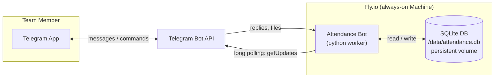
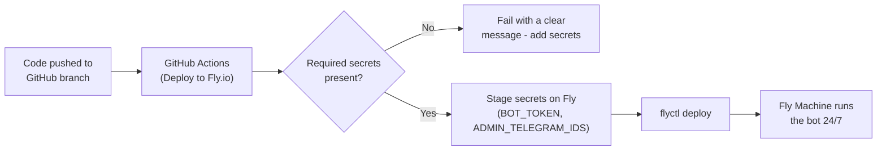
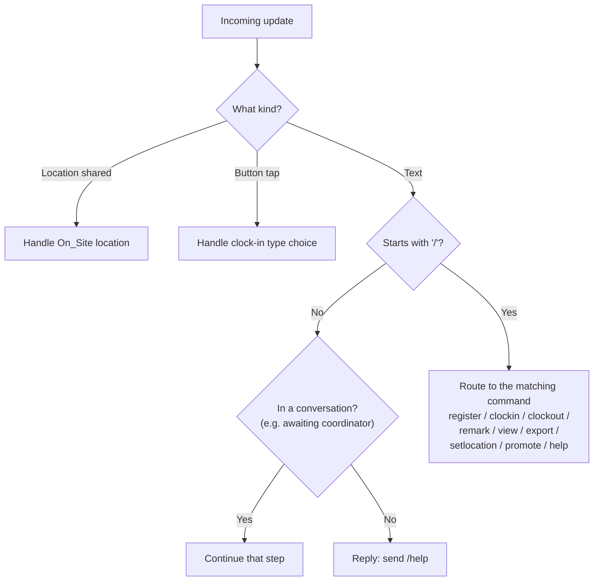
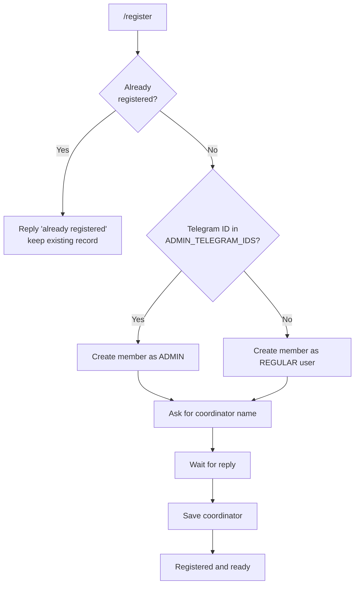
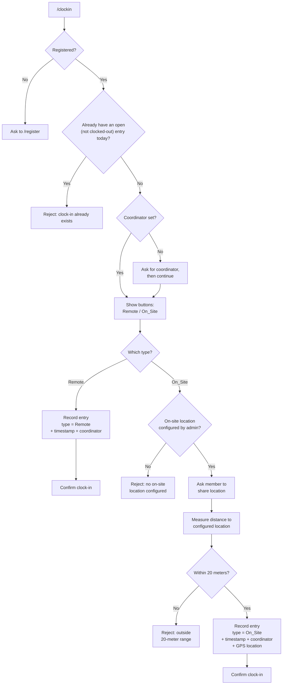
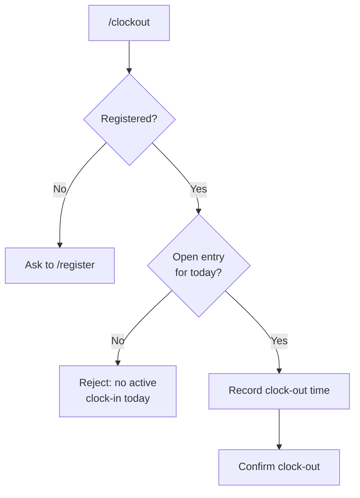
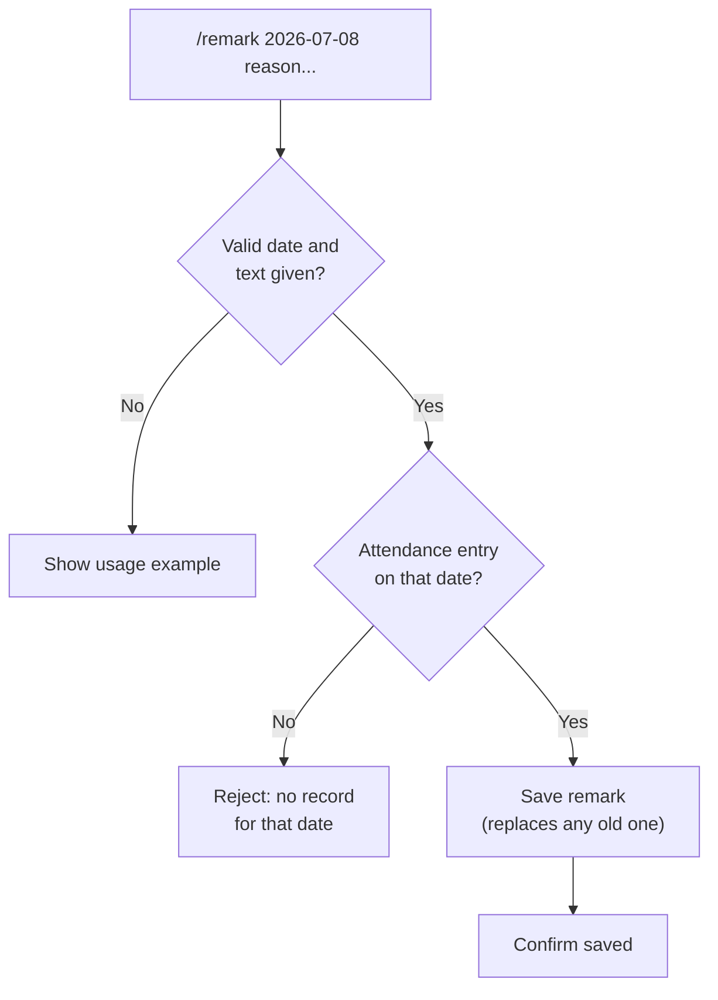
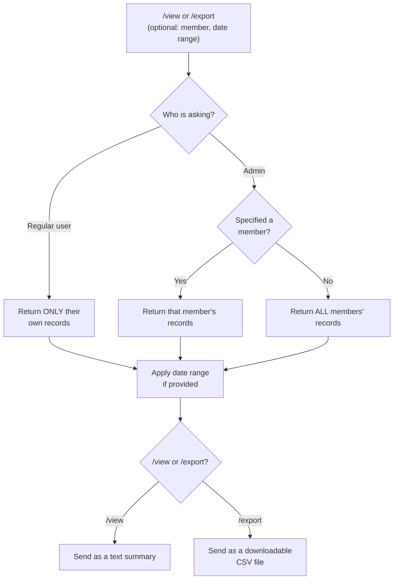
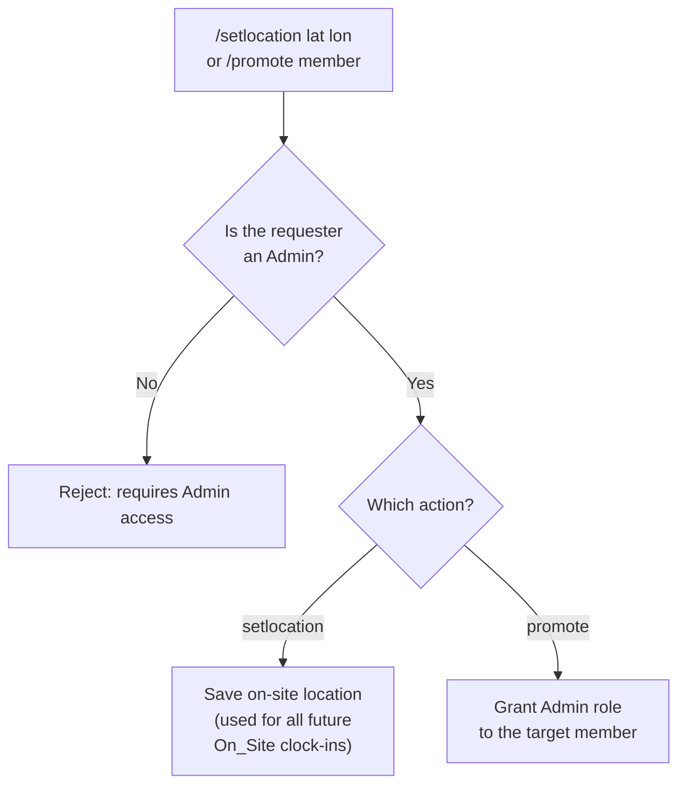

# Telegram Attendance Tracker - Process Flowcharts

Visual diagrams of how the system is built, deployed, and used. GitHub renders
the Mermaid diagrams below automatically - just view this file on GitHub.

---

## 1. System architecture (the big picture)

The bot **pulls** messages from Telegram (long polling) and stores everything in
a SQLite database on a persistent disk, so data survives restarts.

---

## 2. Deployment pipeline (how code gets live)

Secrets live in **GitHub → Settings → Secrets** and Fly; they are never in the code.

---

## 3. Command dispatch (what happens when you send anything)

---

## 4. Registration flow (`/register`)

---

## 5. Clock-in flow (`/clockin`) - the core feature

---

## 6. Clock-out flow (`/clockout`)

---

## 7. Late remark flow (`/remark <date> <text>`)

---

## 8. View / Export with role-based access (`/view`, `/export`)

> A regular user asking for someone else's records is always redirected to their
> own - that is the role-based access rule.

---

## 9. Admin-only actions

---

## Data recorded per attendance entry

| Field | Example |
| --- | --- |
| Member | Alice User |
| Date | 2026-07-08 |
| Clock-in time | 2026-07-08 09:02:11 |
| Clock-out time | 2026-07-08 17:30:04 |
| Type | Remote / On_Site |
| Coordinator | Bob |
| Location (On_Site only) | 11.5564, 104.9282 |
| Late remark | "Traffic delay" |
